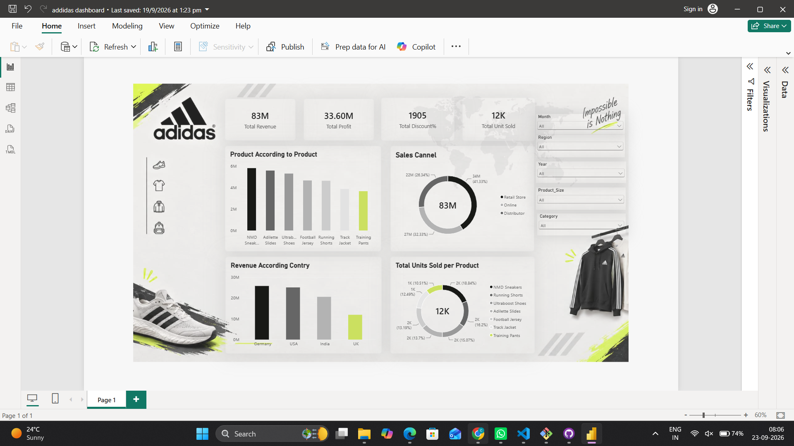

# Adidas Sales Dashboard – Power BI

## 📊 Project Overview

This project is an **Adidas Sales Dashboard built in Microsoft Power BI** to provide an interactive view of sales performance, profitability, products, sales channels, countries, and units sold.

The dashboard is designed as a single-page business intelligence report with KPI cards, bar charts, donut charts, product visuals, and interactive filters.

---

## 🎯 Objective

The main objective of this dashboard is to:

- Monitor overall Adidas sales performance
- Track total revenue and profit
- Analyze total units sold
- Compare product-level performance
- Understand revenue contribution by country
- Analyze sales across different channels
- Provide interactive filtering for business analysis
- Present key information in a clear and visually appealing format

---

## 🛠️ Tools & Technologies

- **Microsoft Power BI**
- **Power Query** – Data preparation and transformation
- **DAX** – Measures and KPI calculations
- **Data Visualization** – Bar charts, donut charts, KPI cards and interactive slicers

---

## 📌 Key Performance Indicators

The dashboard displays the following headline KPIs:

| KPI | Dashboard Value |
|---|---:|
| Total Revenue | 83M |
| Total Profit | 33.60M |
| Total Discount % | 1905 |
| Total Units Sold | 12K |

> KPI values shown above are based on the dashboard view in the provided screenshot and may change when filters are applied.

---

## 📈 Dashboard Visualizations

### 1. Product Performance

A bar chart titled **"Product According to Product"** compares revenue/performance across the available Adidas products:

- NMD Sneakers
- Adilette Slides
- Ultraboost Shoes
- Football Jersey
- Running Shoes
- Track Jacket
- Training Pants

This visual helps identify the relative contribution of each product.

### 2. Sales Channel Analysis

The **Sales Channel** donut chart breaks total revenue across:

- Retail Store – approximately 34M (41.33%)
- Online – approximately 27M (32.33%)
- Distributor – approximately 22M (26.34%)

This provides a quick view of how sales are distributed between different channels.

### 3. Revenue by Country

The **Revenue According Country** chart compares revenue for:

- Germany
- USA
- India
- UK

This allows users to compare geographical sales performance.

### 4. Units Sold by Product

The **Total Units Sold per Product** donut chart shows the distribution of units sold across the different Adidas product categories.

The visual includes:

- NMD Sneakers
- Running Shoes
- Ultraboost Shoes
- Adilette Slides
- Football Jersey
- Track Jacket
- Training Pants

### 5. Interactive Filters

The dashboard contains slicers/filters for:

- **Month**
- **Region**
- **Year**
- **Product Size**
- **Category**

These filters allow users to drill into specific portions of the sales data and dynamically update the dashboard visuals.

---

## 💡 Dashboard Highlights

The dashboard provides a compact overview of Adidas business performance by combining:

- Revenue analysis
- Profit analysis
- Discount analysis
- Units sold analysis
- Product comparison
- Sales channel comparison
- Country-level revenue analysis
- Interactive filtering

The combination of these visuals makes it possible to move from a high-level business overview to more detailed product, geographical, and channel analysis.

---

## 🧩 Dashboard Layout

The Power BI report follows a structured single-page layout:

1. **Top section** – Adidas branding and KPI cards
2. **Middle section** – Product and sales-channel analysis
3. **Bottom section** – Country revenue and product unit analysis
4. **Right section** – Interactive slicers
5. **Decorative section** – Adidas product imagery and branding elements

---

## 🔍 How to Use the Dashboard

1. Open the Power BI report.
2. Review the KPI cards for the overall business summary.
3. Use the slicers on the right side to select a:
   - Month
   - Region
   - Year
   - Product Size
   - Category
4. Observe how the charts update based on the selected filters.
5. Compare product performance using the product bar chart.
6. Analyze channel contribution using the Sales Channel donut chart.
7. Compare geographical performance using the country revenue chart.
8. Review product-level unit distribution using the Total Units Sold chart.

---

## 📂 Project Deliverables

The project can contain the following files:

- `.pbix` – Power BI dashboard/report
- Source dataset – Data used for analysis
- `README.md` – Project documentation

---

## 📌 Important Note

The values documented in this README represent the dashboard state visible in the provided screenshot. Since Power BI visuals are interactive, the displayed KPIs and chart values can change depending on the filters selected by the user.

---

## 👤 Project Type

**Business Intelligence / Data Visualization / Power BI Dashboard**

**Domain:** Retail & Sportswear Sales Analytics

